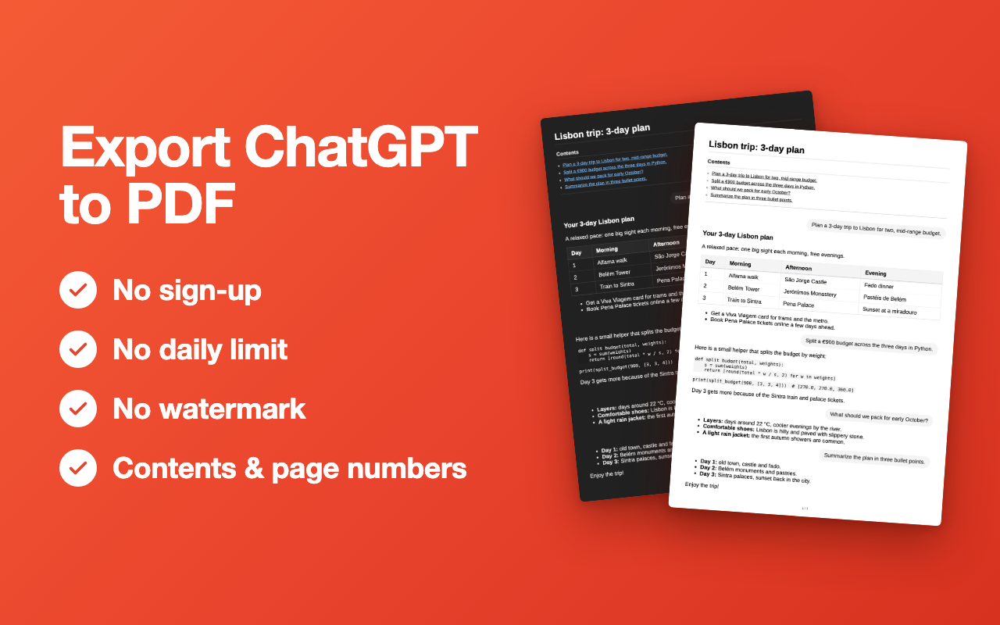
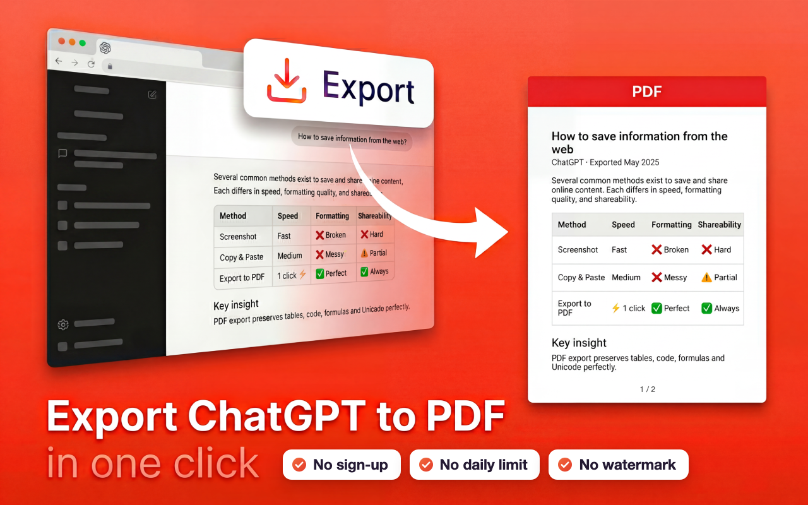

# Журнал дизайна

Кадры, слова автора и решения по внешнему виду продукта и его страниц. Заведён 2026-09-28 — с первой правки,
которую ведём по правилу журнала. Подробные «почему» — в `DECISIONS.md`, здесь — то, что видит глаз.
Кадры — `dizajn/kadry/`.

---

## 2026-09-28 — Страница удаления: форма в карточке-наклейке

**Слово автора** (ведро 28.09, из сессии fib): «встроить Google-форму „почему удалили“ в дизайн страниц других продуктов
так же красиво, как на fib-pages/uninstall»; сегодня — «да, делай — счётчик на ЭкспортГПТ — нет, не нужно пока».
**Было:** серая карточка без лица, сверху мелкая подпись «EXPORT CHATGPT», форма, внизу «Reinstall the extension».
**Стало** (`exportgpt-pages/uninstall.html`, адрес страницы прежний): светлое поле, как у welcome; заголовок по образцу
fib — иконка продукта (настоящая, `icons/icon128.png` → `exportgpt-pages/icon.png`, чуть погашена и наклонена) и
«Export ChatGPT Conversation was removed», просьба одной строкой; форма в белой карточке с чернильной обводкой #0d0d0d и
тенью-наклейкой — градиентом иконки (#ff9a3d → #ff4d1f), наклон −0,5°. Ссылки — тёмно-оранжевые #b8431c: акцент #e55a2f
на светлом поле читается хуже нормы. Нет формы — строка с письмом на адрес из политики. На узком окне иконка встаёт над
заголовком, форме даётся 600 px высоты.
Было → стало → узкое окно:
`dizajn/kadry/2026-09-28-uninstall-bylo.png` · `…-uninstall-stalo.png` · `…-uninstall-stalo-375.png`.
Прежняя страница — `exportgpt-pages/variants/2026-09-28-do-naklejki/uninstall.html`.

## 2026-09-28 (вечер) — Страница удаления: вопрос — главный, интерфейса Google Forms нет

**Автор** (глядя на выложенную наклейку с формой внутри): «нет, выглядит всё глупо. Всё внимание — на заголовках страницы, а внутри формы всё теряется… нужно, чтобы главным был вопрос what went wrong? его можно в принципе вынести в заголовок сайта, а внутри я бы тогда убрал. И сейчас цвета и вся красота вокруг, а внутренность — сама форма, которая и так имеет мусорный интерфейс, вообще с лишней фразой „Чтобы сохранить изменения, войдите в аккаунт Google“… если можно, чтобы они шли в ту же таблицу и без формы — то нафиг она и не нужна».
**Стало** (`exportgpt-pages/uninstall.html`): тихая строка «<иконка> <имя> was removed», под ней крупный заголовок — сам вопрос **What went wrong?**;
в карточке-наклейке только своё поле («One line is enough») и кнопка Send в палитре продукта (чёрная, как кнопки ChatGPT, с оранжевой жёсткой тенью). Ответ уходит прямо в ту
же Google-форму (адрес formResponse, номер поля сверен подстановкой) — строки ложатся в ту же таблицу. После отправки на
месте поля — «Thank you — we got it.»; сеть не ответила — строка «Send it by email instead» с уже вписанным текстом.
Enter — отправить, Shift+Enter — новая строка.
Кадры: стало — `dizajn/kadry/2026-09-28-uninstall-vopros.png` · с набранным текстом — `…-vopros-nabran.png` · узкое окно — `…-vopros-375.png`.
Прежняя страница (наклейка с формой) — `variants/2026-09-28-naklejka-s-formoj/`.

## 2026-10-03 — Страница удаления (`exportgpt-pages/uninstall.html`): поле не обязательное
**Автор:** «Новая страница удаления не отправляет пустое поле — исправь это, не надо делать это поле обязательным».
Пустой Send теперь тоже отправляется: в таблицу уходит одна пометка источника без текста, страница говорит «Thank you — we got it».
Проверено настоящим кликом по Send при пустом поле на всех трёх страницах удаления (ExportGPT, fib, таймер); отправка в Google перехвачена — в таблицу ничего не ушло.
Повод: ответ 03.10 «njb,luivlgyujlv,gjhvlu,icv» — набор по клавишам, чтобы пройти обязательное поле (ГОЛОСА 10-03).
**Автор (03.10, следом):** «Страницы оценки 1–3★ устроены так же… — да, сделай». Сделано и там: пустой Send уходит пометкой «[rating N★]» — сама оценка (`feedback.html`). Проверено так же — кликом, с перехватом отправки.

## 2026-10-04 — Баннер CWS 1280×800 с фичами (черновик, ждёт слова автора)
**Автор:** «Я тебя просил сделать новый баннер, чтобы ты указал там фичи» (после разбора листинга: у лидеров
3 PDF в день, вход и логотип, у нас ничего этого нет; переписывать описание — не нужно).
**Стало** (`dizajn/banner/2026-10-04-fichi/`): тот же красно-оранжевый градиент и белый жирный заголовок, что у
нынешних двух скриншотов в сторе; слева «Export ChatGPT to PDF» и четыре фичи — No sign-up · No daily limit ·
No watermark · Contents & page numbers (слова «free» нет — канон запрещает); справа два НАСТОЯЩИХ листа,
светлый и тёмный: английский демо-чат (поездка в Лиссабон: таблица, код, списки), выгруженный 1.1.11 через
наш сервер (`tests/blockmode-live-stand.html?demo=1`, `tests/e2e-render.js`), а не нарисованный макет.
Нынешний скриншот №2 рисует несуществующий колонтитул «Exported with…» и дату «May 2025» — этот не врёт.
Номера страниц есть только с 1.1.11: баннер ставить в стор вместе с её выходом, не раньше.
Сборка: `banner.html` → headless Chrome `--screenshot --window-size=1280,800` → `banner.png` (488 КБ, канон ≤800).

**Автор (04.10, следом):** «Отвратительный баннер — я просил тебя доработать тот, что у нас уже был — не нужно
выдумывать». Вариант выше отвергнут (лежит как история, в стор не идёт). **Урок: «баннер с фичами» при живом
баннере = доработка живого, не новый.**

## 2026-10-04 — Баннер CWS: доработка нынешнего (черновик, ждёт слова автора)
**Стало** (`dizajn/banner/2026-10-04-dorabotka/`): тот самый баннер, что в сторе
(`html_pdf_converter/banner/banner_large_simplified_1280_800.png` = `original.png`), не тронут; поверх — две
правки: (1) справа от «in one click» три белые плашки в стиле плашки «Export» — No sign-up · No daily limit ·
No watermark; (2) подпись листа PDF «Page 1 of 2 · Exported with Export ChatGPT Conversation» (фирменного
колонтитула у нас нет — спорил бы с «No watermark») → «1 / 2», как в настоящем PDF 1.1.11; шва нет (проверено
крупно). В стор — вместе с выходом 1.1.11.

