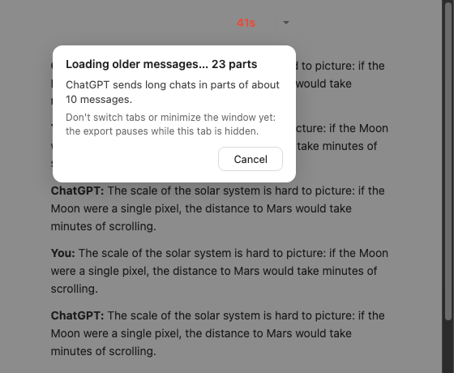
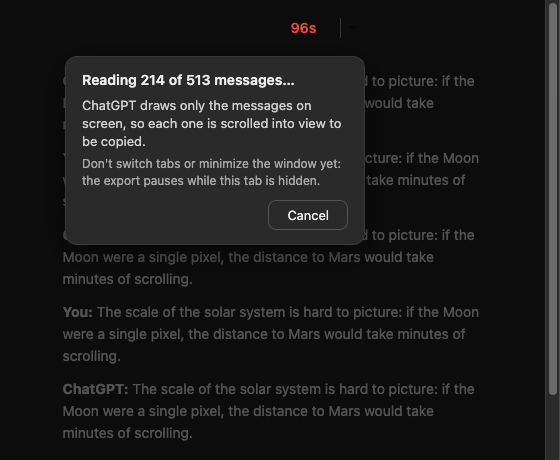
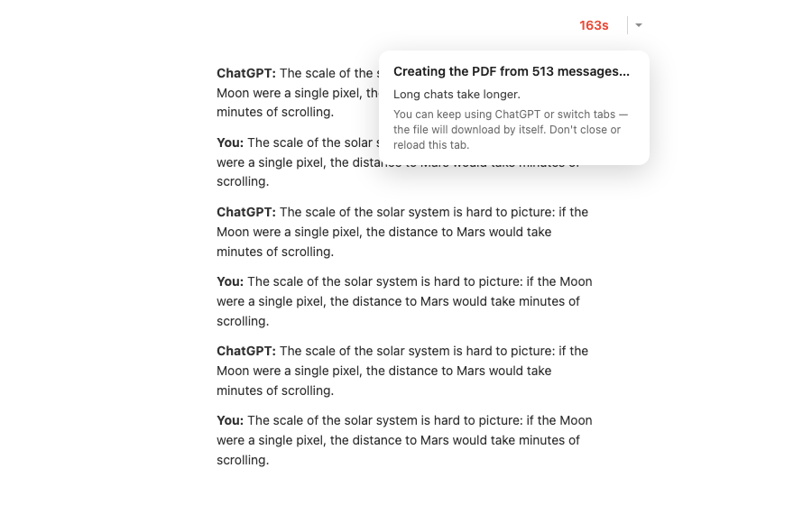
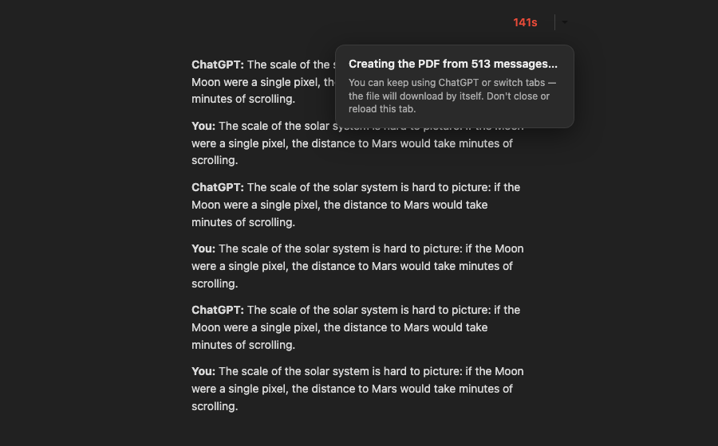
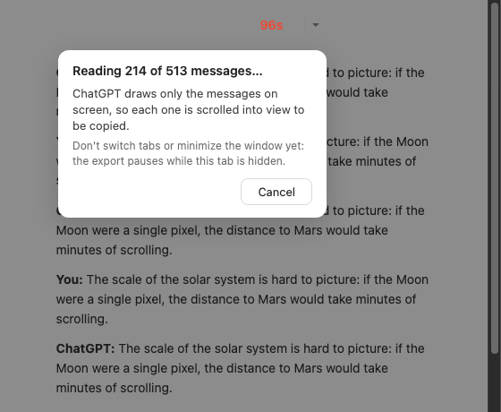
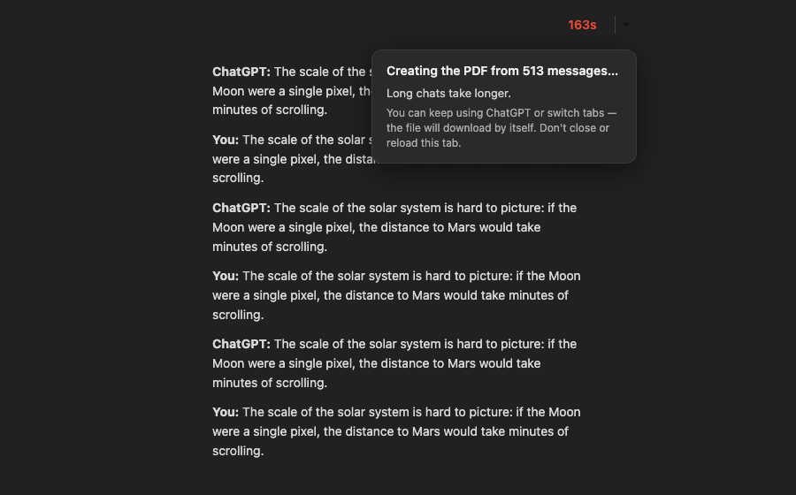
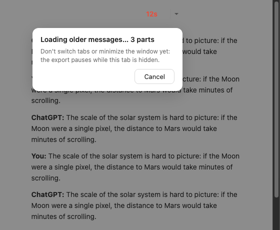
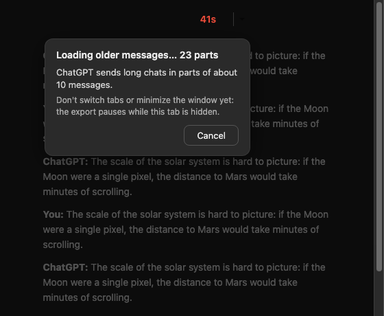
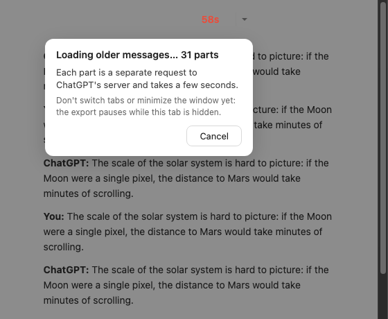
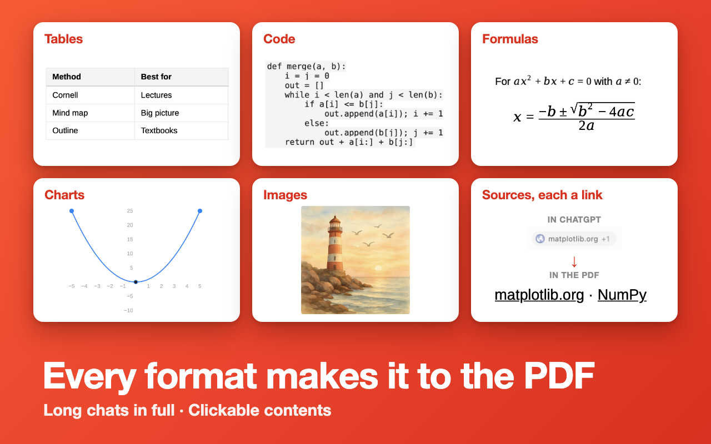

# Журнал дизайна

Кадры, слова автора и решения по внешнему виду продукта и его страниц. Заведён 2026-09-28 — с первой правки,
которую ведём по правилу журнала. Подробные «почему» — в `DECISIONS.md`, здесь — то, что видит глаз.
Кадры — `dizajn/kadry/`.

---

## 2026-09-28 — Страница удаления: форма в карточке-наклейке

**Слово автора** (ведро 28.09, из сессии fib): «встроить Google-форму „почему удалили“ в дизайн страниц других продуктов
так же красиво, как на fib-pages/uninstall»; сегодня — «да, делай — счётчик на ЭкспортГПТ — нет, не нужно пока».
**Было:** серая карточка без лица, сверху мелкая подпись «EXPORT CHATGPT», форма, внизу «Reinstall the extension».
**Стало** (`exportgpt-pages/uninstall.html`, адрес страницы прежний): светлое поле, как у welcome; заголовок по образцу
fib — иконка продукта (настоящая, `icons/icon128.png` → `exportgpt-pages/icon.png`, чуть погашена и наклонена) и
«Export ChatGPT Conversation was removed», просьба одной строкой; форма в белой карточке с чернильной обводкой #0d0d0d и
тенью-наклейкой — градиентом иконки (#ff9a3d → #ff4d1f), наклон −0,5°. Ссылки — тёмно-оранжевые #b8431c: акцент #e55a2f
на светлом поле читается хуже нормы. Нет формы — строка с письмом на адрес из политики. На узком окне иконка встаёт над
заголовком, форме даётся 600 px высоты.
Было → стало → узкое окно:
`dizajn/kadry/2026-09-28-uninstall-bylo.png` · `…-uninstall-stalo.png` · `…-uninstall-stalo-375.png`.
Прежняя страница — `exportgpt-pages/variants/2026-09-28-do-naklejki/uninstall.html`.

## 2026-09-28 (вечер) — Страница удаления: вопрос — главный, интерфейса Google Forms нет

**Автор** (глядя на выложенную наклейку с формой внутри): «нет, выглядит всё глупо. Всё внимание — на заголовках страницы, а внутри формы всё теряется… нужно, чтобы главным был вопрос what went wrong? его можно в принципе вынести в заголовок сайта, а внутри я бы тогда убрал. И сейчас цвета и вся красота вокруг, а внутренность — сама форма, которая и так имеет мусорный интерфейс, вообще с лишней фразой „Чтобы сохранить изменения, войдите в аккаунт Google“… если можно, чтобы они шли в ту же таблицу и без формы — то нафиг она и не нужна».
**Стало** (`exportgpt-pages/uninstall.html`): тихая строка «<иконка> <имя> was removed», под ней крупный заголовок — сам вопрос **What went wrong?**;
в карточке-наклейке только своё поле («One line is enough») и кнопка Send в палитре продукта (чёрная, как кнопки ChatGPT, с оранжевой жёсткой тенью). Ответ уходит прямо в ту
же Google-форму (адрес formResponse, номер поля сверен подстановкой) — строки ложатся в ту же таблицу. После отправки на
месте поля — «Thank you — we got it.»; сеть не ответила — строка «Send it by email instead» с уже вписанным текстом.
Enter — отправить, Shift+Enter — новая строка.
Кадры: стало — `dizajn/kadry/2026-09-28-uninstall-vopros.png` · с набранным текстом — `…-vopros-nabran.png` · узкое окно — `…-vopros-375.png`.
Прежняя страница (наклейка с формой) — `variants/2026-09-28-naklejka-s-formoj/`.

## 2026-10-03 — Страница удаления (`exportgpt-pages/uninstall.html`): поле не обязательное
**Автор:** «Новая страница удаления не отправляет пустое поле — исправь это, не надо делать это поле обязательным».
Пустой Send теперь тоже отправляется: в таблицу уходит одна пометка источника без текста, страница говорит «Thank you — we got it».
Проверено настоящим кликом по Send при пустом поле на всех трёх страницах удаления (ExportGPT, fib, таймер); отправка в Google перехвачена — в таблицу ничего не ушло.
Повод: ответ 03.10 «njb,luivlgyujlv,gjhvlu,icv» — набор по клавишам, чтобы пройти обязательное поле (ГОЛОСА 10-03).
**Автор (03.10, следом):** «Страницы оценки 1–3★ устроены так же… — да, сделай». Сделано и там: пустой Send уходит пометкой «[rating N★]» — сама оценка (`feedback.html`). Проверено так же — кликом, с перехватом отправки.

## 2026-10-04 — Баннер CWS 1280×800 с фичами (черновик, ждёт слова автора)
**Автор:** «Я тебя просил сделать новый баннер, чтобы ты указал там фичи» (после разбора листинга: у лидеров
3 PDF в день, вход и логотип, у нас ничего этого нет; переписывать описание — не нужно).
**Стало** (`dizajn/banner/2026-10-04-fichi/`): тот же красно-оранжевый градиент и белый жирный заголовок, что у
нынешних двух скриншотов в сторе; слева «Export ChatGPT to PDF» и четыре фичи — No sign-up · No daily limit ·
No watermark · Contents & page numbers (слова «free» нет — канон запрещает); справа два НАСТОЯЩИХ листа,
светлый и тёмный: английский демо-чат (поездка в Лиссабон: таблица, код, списки), выгруженный 1.1.11 через
наш сервер (`tests/blockmode-live-stand.html?demo=1`, `tests/e2e-render.js`), а не нарисованный макет.
Нынешний скриншот №2 рисует несуществующий колонтитул «Exported with…» и дату «May 2025» — этот не врёт.
Номера страниц есть только с 1.1.11: баннер ставить в стор вместе с её выходом, не раньше.
Сборка: `banner.html` → headless Chrome `--screenshot --window-size=1280,800` → `banner.png` (488 КБ, канон ≤800).

**Автор (04.10, следом):** «Отвратительный баннер — я просил тебя доработать тот, что у нас уже был — не нужно
выдумывать». Вариант выше отвергнут (лежит как история, в стор не идёт). **Урок: «баннер с фичами» при живом
баннере = доработка живого, не новый.**

## 2026-10-04 — Баннер CWS: доработка нынешнего (черновик, ждёт слова автора)
**Стало** (`dizajn/banner/2026-10-04-dorabotka/`): тот самый баннер, что в сторе
(`html_pdf_converter/banner/banner_large_simplified_1280_800.png` = `original.png`), не тронут; поверх — две
правки: (1) справа от «in one click» три белые плашки в стиле плашки «Export» — No sign-up · No daily limit ·
No watermark; (2) подпись листа PDF «Page 1 of 2 · Exported with Export ChatGPT Conversation» (фирменного
колонтитула у нас нет — спорил бы с «No watermark») → «1 / 2», как в настоящем PDF 1.1.11; шва нет (проверено
крупно). В стор — вместе с выходом 1.1.11.

## 2026-10-07 — Карточка экспорта: от клика до файла (1.1.12-dev · 07.10 14:45)
**Автор:** «если мы надолго бросим пользователя, например если там будет уже идти второй десяток секунд… человек
может начать сомневаться, а дойдёт ли скачивание до конца»; про плашку о вкладке — «это адекватное сообщение? или
излишнее?», и «давай дадим в ней какой-нибудь факт… про то, как работает дом ChatGPT»; тексты — «суше, короче,
законичнее, но суть — верная»; «собирай».
**Было:** карточка только на прокрутке («Loading conversation…» + «Please keep this tab open and in the
foreground»); после прокрутки — пусто, лишь счётчик секунд в кнопке Export, на длинном чате 30–70 с.
**Стало:** одна карточка до файла, три строки — что идёт сейчас · факт о ChatGPT · что можно делать.
Шаги: «Loading older messages… 23 parts» (+ «ChatGPT sends long chats in parts of about 10 messages.») →
«Reading 214 of 513 messages…» (с 5-й секунды + «ChatGPT draws only the messages on screen, so each one is
scrolled into view to be copied.») → «Adding images… 12 of 48» → «Compressing images… 5 of 30» → «Creating the PDF
from 513 messages… 0:23» (+ «You can switch tabs now — the file will download by itself.», с 20-й секунды
«Long chats take longer.»). На прокрутке подсказка — «Keep this tab visible: in a hidden tab ChatGPT stops
loading messages, and the export waits.» Обе подсказки о вкладке измерены в настоящем Chrome (CHATGPT-DOM §10,
07.10). Короткий экспорт карточку не мигает: без прокрутки она появляется, только если идёт дольше 3 с.
Число частей в факте A убрано — оно уже в строке над ним.
Кадры (светлая и тёмная): `kadry/2026-10-07-kartochka/` — pages · reading · paused · images · shrink · server · long.

**Автор (07.10, следом):** «ChatGPT sends long chats in parts… — пусть это сообщение появляется не сразу, а например
через 10 секунд ожидания. Будет ощущение, что мы ведём диалог с юзером порционно, когда это нужно». → Оба факта
теперь приходят на 10-й секунде своего шага (правило одно: `GPTPDF_FACT_AFTER_MS`); стенд — сцена K.
**Автор (07.10):** «а нельзя ли ещё разблокировать экран чата, чтобы юзер мог что-то делать в ChatGPT — перейти в
другой чат, читать и скроллить текущий?» → С «Compressing images» затемнение снимается, карточка уходит в правый
нижний угол (без точек, с часами), страница кликается и крутится. Раньше нельзя: «Adding images» ещё читает живую
страницу. Подсказка: «You can keep using ChatGPT or switch tabs — the file will download by itself. Don't close or
reload this tab.» Проверено в настоящем Chrome: колесо мыши над чатом крутит ленту, переход на главную ChatGPT
внутри вкладки — файл приходит (39,6 с после прокрутки); перезагрузка вкладки — файл не приходит.

**Автор (07.10, о подсказке «Keep this tab visible…» с самого начала):** «тоже лишняя — мы заставляем с самого начала
читать какую-то информацию мелким шрифтом». → Заранее не говорим. Фраза появляется, только если вкладка правда была
скрыта дольше секунды, — после возвращения: «The export waited while this tab was hidden: ChatGPT loads messages
only in a visible tab.»
**Автор (07.10, скриншот):** «в двух разных местах счётчики, и с разными цифрами… выглядит плохо организовано. Цифра
пусть будет одна… может быть поместить её туда, наверх, тогда всё будет там наверху, где кнопка, — "приучаем" к
одному месту». → Число одно — время с клика, в самой кнопке (как и было: «96s»). Слова — панелью прямо под кнопкой,
там, где открывается её меню, на всех шагах. На чтении страница затемнена, кнопка и панель — поверх затемнения; с
«Compressing images» затемнения нет, панель на месте. Часы из панели убраны («Creating the PDF from 513 messages…»).

**Автор (07.10, 20:13, о факте «ChatGPT sends long chats in parts…» через несколько секунд после начала):** «это не
даёт мне как пользователю указания, что нельзя сворачивать или менять таб, — оно через 10 секунд после начала несло
бы пользу». → На 10-й секунде прокрутки — что делать: «Don't switch tabs or minimize the window yet: the export
pauses while this tab is hidden.» «yet» — потому что дальше, на «Creating the PDF», карточка сама скажет, что уже
можно. Факты сдвинуты на 30-ю секунду шага — один голос за раз. Кто ушёл до 10-й секунды и вернулся, видит
объяснение «The export waited…» — запоздалое предупреждение его не затирает (стенд, сцена L). Кадры `pages-*`,
`reading-*` перерисованы с этой строкой; новый `stay-*` — 12-я секунда.

**Автор (07.10, 20:3x):** «появился вроде на 3-й секунде про 10 сообщений, но он не менялся, а где-то на 60-й исчез; у нас
же было 2–3 разных текста для разнообразия». → Было три факта, но каждый привязан к своему шагу; на его чате чтение
идёт ~10 с и свой факт (с 30-й секунды) не успевал. Слово автора «да, делай ротацию»: факты догрузки сменяют друг
друга каждые 20 с с 30-й секунды — «ChatGPT sends long chats in parts of about 10 messages.» ↔ «Each part is a
separate request to ChatGPT's server and takes a few seconds.» (замер §10: ~4–5 с на часть, ждём сервер); факт чтения
— с 10-й секунды чтения. Стенд: сцена K (30 → 50 → 70 с; чтение +10 с) ✅. Кадр `request-*` — 58-я секунда.

## 2026-10-08 — Третий скриншот CWS: «Every format makes it to the PDF» (черновик, ждёт слова автора)
**Автор:** «давай ещё сделаем один баннер к нашим двум — третий, в котором укажем наши преимущества: что форматирование
передаётся — все форматы, вот может это наше решение с двумя ссылками показать»; следом — «может быть даже сделать слайд
с набором деталей, чтобы было видно, с какими кейсами и форматами справляется — ссылки, графики, код…»; из двух — «1»
(шесть плиток 3×2). По дороге найдено: формулы в PDF печатались «x2» — автор: «2, потом 1» (сперва починка формул,
1.2.2, потом баннер), поэтому плитка Formulas — правда только с 1.2.2: баннер в стор вместе с ней.
**Стало** (`dizajn/banner/2026-10-08-formaty/`): стиль двух нынешних (градиент, белый заголовок снизу слева); шесть
белых плиток — Tables · Code · Formulas · Charts · Images · Sources, each a link; заголовок «Every format makes it to the
PDF», строка «Long chats in full · Clickable contents». Каждая плитка — вырезка из НАСТОЯЩЕГО PDF через наш сервер:
таблица, код, формулы, картинка — демо-чат стенда (`blockmode-live-stand.html?demo=formats` → `e2e-render.js`; картинка —
пиксель-арт автора из «Художника»), график и «matplotlib.org · NumPy» — тестовый чат автора в светлой теме. Таблица
обрезана до двух столбцов (во всю ширину листа в плитке не читалась).

**Автор (08.10, следом):** «по картинке — возьми что-то нейтральное; formulas — да, я буду подавать баннеры одновременно с
1.2.2; плитка источников — да, покажи на фоне того, как это выглядит в чате». → Картинка — акварельный маяк (gpt-image-1),
выгружен тем же конвейером. Плитка источников: «IN CHATGPT» — снимок настоящей плашки «matplotlib.org +1» со страницы
шаринга, стрелка, «IN THE PDF» — «matplotlib.org · NumPy» из PDF. Ставится в стор вместе с 1.2.2.

